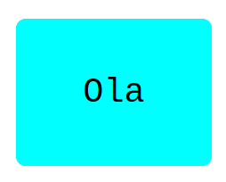

# Hello Rails React
- This is basic project for understand react-rails gem.
- API created with ruby on rails.
- When page refresh page shows random greeting from API that include 5 different greeting.
  

## Built With

- Ruby on Rails
- React
- Redux

## Setup
- Clone this project
```
- $ git clone https://github.com/ahmetbozaci/hello-rails-reactv2
- $ cd hello-rails-reactv2
```

```
- $ npm install
- $ bundle install
- $ rails db:migrate
- $ rails db:seeds
```
- Open website
```
- $ rails s
```
## Authors

👤 **Ahmet Bozacı**
- Github:[ ahmetbozaci](https://github.com/ahmetbozaci)
- Twitter:[ ahmtbozaci](https://twitter.com/ahmtbozaci)
- LinkedIn:[ ahmetbozaci](https://www.linkedin.com/in/ahmetbozaci/)

## 🤝 Contributing

Contributions, issues, and feature requests are welcome!

Feel free to check the [issues page](../../issues/).

## Show your support

Give a ⭐️ if you like this project!


